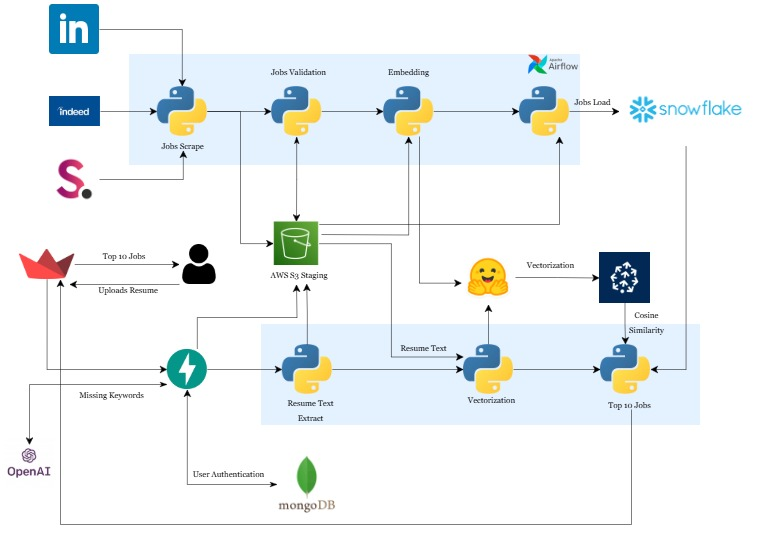

# CareerSage

## Technologies Used  
- Hugging Face  
- OpenAI  
- Pinecone  
- Amazon AWS  
- Snowflake  
- Python  
- Pandas  
- NumPy  
- Docker  
- Airflow  
- Selenium  
- FastAPI  
- Streamlit  
- MongoDB  
- Plotly  
- GitHub  


## Overview

CareerSage is a revolutionary Job Recommendation System designed to streamline and enhance the job search experience by centralizing the job search process and by analyzing user uploaded resumes. Our platform provides tailored job recommendations from top platforms like LinkedIn, Indeed, and SimplyHired. Users gain direct access to recommended job listings, ensuring a personalized and efficient job search experience.

## Problem Statement

### Challenge:
The current scenario for the job search process is really tiresome and exhilarating for job seekers. A user currently has to go through every job portal manually, browse through the available jobs, and make a profile describing the role he/she is targeting; which consumes a lot of time. We wanted to optimize the process by making an application that will bring jobs from different portals and filter them based on the user's resume, by using modern technologies, hence easing the process for job seekers.

### Solution:
The objective of CareerSage is to develop and deploy an efficient RAG solution for a Job Recommendation System, which facilitates the seamless matching of job seekers with relevant employment opportunities based on their uploaded resumes. Unlike traditional job search platforms, our system will aggregate jobs from several portals, utilize advanced data processing techniques to analyze the content of user's resumes, and recommend suitable job openings from various sources such as LinkedIn, Indeed, and SimplyHired. The system will not only match job seekers with relevant positions but also provide direct access to the recommended job listings through provided links.

### Domains of scraped jobs
- Data Engineer
- Software Engineer
- Data Analyst
- Data Scientist
- Backend Developer
- UI UX Developer
- Financial Analyst
- Full stack developer
- Supply Chain Manager
- Front End Developer
- Devops Engineer
- Product Manager

## Architecture:



[](https://youtu.be/ChYG-aspZIg)


## Prerequisites
Before running this project, ensure you have the following prerequisites set up:

- **Python**: Ensure Python is installed on your system.
- **Docker**: Ensure Docker-desktop is installed on your system.
- **Virtual Environment**: Set up a virtual environment to manage dependencies and isolate your project's environment from other Python projects. You can create a virtual environment using `virtualenv` or `venv`.
- **requirements.txt**: Install the required Python dependencies by running the command:
  ```
  pip install -r requirements.txt
  ```
- **Config File**: Set up the `configurations.properties` file with the necessary credentials and configurations.

- **Snowflake**: Use `setup/snowflake_objects.sql` to define the queries on snowflake. Also, ensure you have the necessary credentials and configurations set up in the `configurations.properties` file for connecting to Snowflake.

- **AWS Platform**: Create an AWS S3 bucket as a stage storage of resumes and jobs. Ensure you have the necessary credentials and configurations set up in the `configurations.properties` file.
